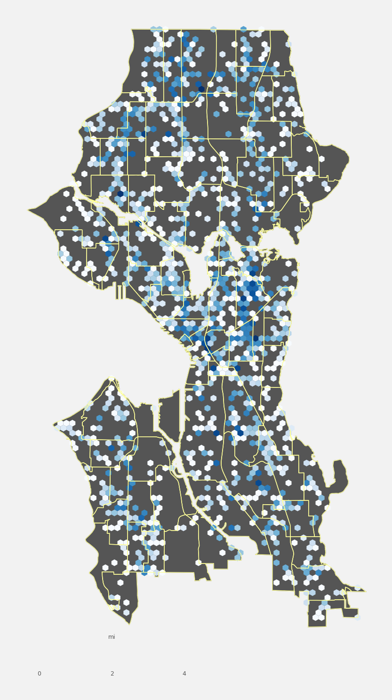
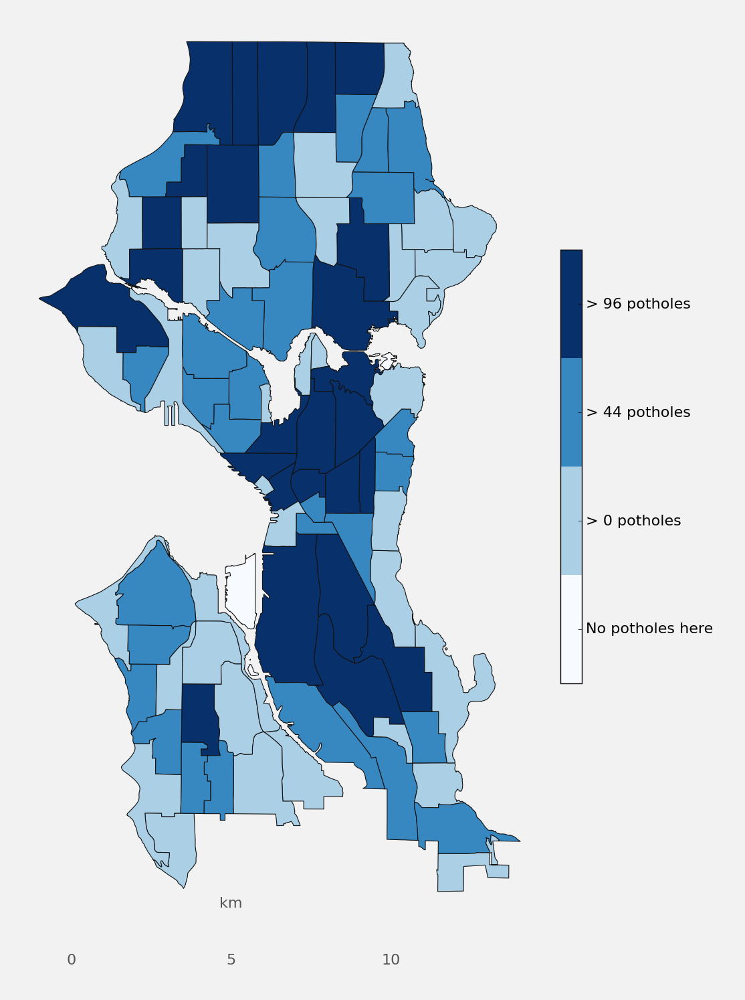

# pothole_repair
Predicting time to repair Seattle city potholes
=======

####Motivation

Recently, a neighbor expressed to me his opinion that the city government where we live could not be that great since the roads are so bad.  Reflecting on this, I began to wonder if data science could help us understand more about what influences the time required for potholes to be repaired.  This is likely to be of interest to a range of people, from ordinary citizens to cyclists to city leaders to data scientists. 

Here are the steps I followed in investigating this question:

####Built Data Pipeline

#####Obtain Data

Data sources included the following:

* Pothole data (https://catalog.data.gov/dataset/pothole-repairs-eaf38)

* Shapefiles of Seattle neighborhoods and street network features (https://data.seattle.gov/dataset/data-seattle-gov-GIS-shapefile-datasets/f7tb-rnup)

* U.S. Census data containing information on home values and incomes (http://factfinder.census.gov/faces/nav/jsf/pages/index.xhtml)

* Temperature and precipitation information from NOAA (http://www.noaa.gov/)

After cleaning there were records for approximately 19,000 potholes spanning from 2010 to the download date in August, 2015.

#####Geocode Pothole Locations

Pothole locations were typically descibed only in general terms, e.g., lying on a particular street between that street's intersection with two other streets.  This necessitated a geocoding step, which was carried out using a geocoding web service provided via a google API and accessed through the Python module, geopy.  Unfortunately, the API's daily and rate quotas did not allow geocoding the entire dataset in the time available.  The analysis was done on about 7,000 rows of data.

#####Engineering Features

A big part of this project was searching for and engineering features I thought likely to explain variation in pothole repair times.  I extracted these features and associated them with the appropriate pothole. The list included the following:

* Colder temperatures could be correlated with more potholes and/or longer repair times.  I mapped to each pothole the average temperature on the pothole initialization date.

* Economic variables could influence variation in repair times.  I mapped median home values and household income aggregated at the census block group level to each pothole based on a 2009-2013 data.

* I used a closest distance calculation to associate to the closest pothole physical descriptions of street features such as segment type (e.g. alley or street), structure (e.g. elevated or below grade), and type of vehicle usage allowed.

* I computed the minimum distance from each pothole to prominent landmarks, e.g., the Convention Center, Pike Place market, and the Space Needle, on the possibility that distance from such location could influence repair time.

* I computed the total number of potholes active (i.e., unrepaired) in the system on any given day and associated it with the day each pothole was initiated.  

* I labelled each pothole with the Seattle neighborhood to which it belongs.

* I associated the number of months until the end of the fiscal year for the day on which each pothole was initiated.  The idea here was that end of fiscal year budgets and schedules could potentially influence repair times.

Several of these features were mapped to facilitate visual interrogation.

#####Modeling and Conclusions

I alternated exploratory data analysis with building a logistic regression and a random forest classifier.  The target variable was long vs short repair times with a threshhold of 3 days, the goal Seattle DOT has set for having all potholes repaired.  

I observed some correlation among the features.  Categorical variables such as labels of neighborhoods and street features alone resulted in a ROC AUC score of about 55%.  The random forest classifier improved ROC AUC to 65%, based on the numerical features "cumulative number of potholes, "Median Home Value", "Temperature", "minimum distance to prominent features", and "months until end of FY".  This was the case prior to fine-tuning of model parameters.  Surprisingly, adding categorical variables provided little further improvement in model performance.  I confirmed this based on a calculation of relative feature importance.

####Toolkits & Credits
 
* https://developers.google.com/maps/documentation/geocoding/intro

* geopy, client for popular geocoding web services (https://pypi.python.org/pypi/geopy)

* shapely, for maniulating geometric objects in the Cartesian plane (https://pypi.python.org/pypi/Shapely)

* fiona, for reading and writing from shapefiles (https://github.com/Toblerity/Fiona)

* Basemap, a matplotlib toolkit for plotting 2D data on maps in python. (http://matplotlib.org/basemap/api/basemap_api.html)

* descartes, for using geometric objecdts as matplotlib paths and patches (https://pypi.python.org/pypi/descartes)

* scikit-learn, a resource for Python machine learning libraries (http://scikit-learn.org/stable/)

* Thanks to the team and instructors at Galvanize, as well as my classmates.
